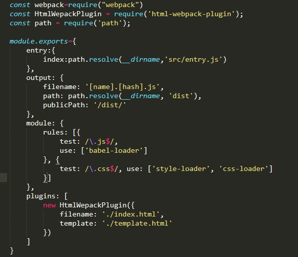

# Webpack4.0构建项目的流程与配置分享 

> **主要内容**
>
> - 介绍Webpack4.0与3.0的主要区别
> - Webpack4.0构建项目基础配置
> - 分模式配置 


## Webpack4.0与Webpack3.0的主要区别

[Webpack4与3区别](https://www.jianshu.com/p/5d306ed6aaff)

1. 需要安装webpack-cli才能在命令行环境下直接启动项目
2. 增加了一个`mode`配置，只有两种值`development | production` ，可以启动内置优化
3. 现在也不需要`UglifyJsPlugin`使用这个plugin了，只需要使用`optimization.minimize`为true就行，production mode下面自动为true 
4. 删除`CommonsChunkPlugin`，改成使用`optimization.splitChunks`进行模块划分 

## 使用之前

​	通过npm安装最新webpack和webpack-cli


## 基础配置

- 配置文件

  webpack.config.js

- 启动

  > 通过npm

  ```javascript
  // package.json
  {
    "scripts": {
      "start": "webpack"
    }
  }
  ```

  > 直接命令行

  ```
  webpack
  ```

  

- [基础配置](https://www.webpackjs.com/concepts/)

  1. 入口(entry)
      - 单入口
      - 多入口
        > 多个入口文件打包成一个文件，不同页面从不同入口进入

  2. 出口(output)

  3. 加载器(loader)

     > 用于处理不同类型的文件，类似编译

     > ES6转码 .babelrc文件

  4. 插件(plugins)

     > 用于处理编译后的文件，进行打包、压缩、优化、复制等操作

  ##### 例子

  

  

## 分模式配置

> webpack.common.conf.js
>
> webpack.dev.conf.js
>
> webpack.prod.conf.js

- 通用配置

```javascript
const path = require('path');
const webpackMerge = require('webpack-merge');
const ProdConfig = require('./webpack.prod.conf');
const DevConfig = require('./webpack.dev.conf');
const CopyWebpackPlugin = require('copy-webpack-plugin');
  
const genarateConfig = env => {
  let config = {
    entry: './src/js/index.js',
    output: {
      path: path.join(__dirname, '../dist'), //输出目录的配置，模板、样式、脚本、图片等资源的路径配置都相对于它
      filename: "bundle.js"
    },
    module: {
      rules: [
        {
          test:/(\.jsx|\.js)$/,
          use:{
            loader:"babel-loader",
            options:{
              presets:[
                "env"
              ]
            }
          },
          exclude:path.resolve(__dirname,"node_modules"),
          include:path.resolve(__dirname,"src")
        }
      ]
    },

    plugins: [
      new CopyWebpackPlugin([{
        from:'./src/assets',
          to:'./assets'
      }, {
        from: './src/index.html',
        to:'./index.html'
      }])
    ]
  }

  return config;
};

module.exports = env => {
  let config = env === 'dev' ? DevConfig : ProdConfig;
  let result = webpackMerge(genarateConfig(env), config);
  return result;
};
```

- 开发模式配置

```javascript
const path = require('path');

module.exports = {
  mode: 'development',
  devtool: 'inline-source-map', 
  
  // 开发服务器
  devServer: {
    contentBase: './',
    watchContentBase: true,
    contentBase:path.resolve(__dirname,'dist'), //服务器根目录入口
    proxy: {        // agent cross-domain interface
      "/api": {
        target: CrossDomainURL,
        changeOrigin: true,
        pathRewrite: {
          "^/api": ""
        }
      }
    },
    overlay: true,  // 页面错误提示浮层
    compress: true, // 压缩代码，提高传输速率，默认false，开发建议为false便于debug
    stats: "errors-only",
    open: true
  }
};
```

- 生产模式配置

```javascript
const CleanWebpackPlugin = require('clean-webpack-plugin');

module.exports = {
  mode: 'production',

  plugins: [
    // 每次构建前清理dist文件夹
    new CleanWebpackPlugin(['dist'], {
        verbose: false,
        exclude: ['assets']
    })
  ]
};
```
